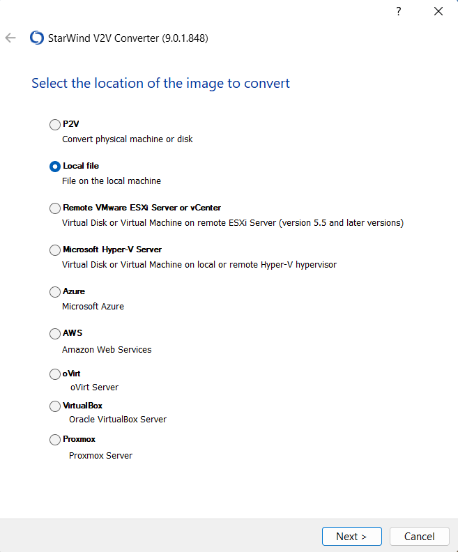
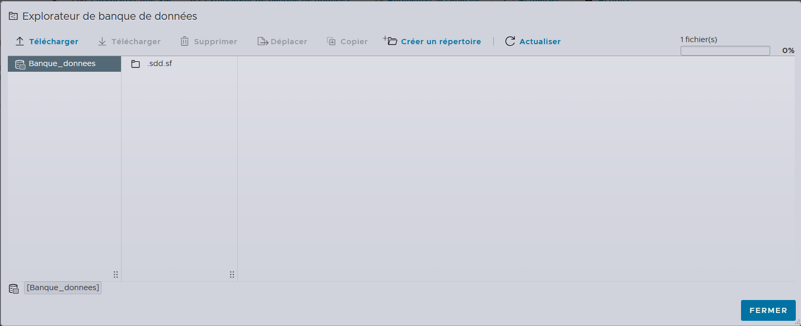

# JOB 08 – Export, conversion et réimportation d’une machine virtuelle

## Objectif

L’objectif de ce job est de **tester l’interopérabilité entre hyperviseurs** en :

* exportant une machine virtuelle Debian depuis **Hyper-V**,
* transférant les fichiers vers la machine hôte,
* convertissant la machine virtuelle à l’aide de **StarWind V2V Converter**,
* puis en l’important et en la démarrant dans **VMware ESXi**.

Ce job permet de valider la portabilité d’une machine virtuelle entre différents environnements de virtualisation.

---

## Contexte

Les environnements professionnels nécessitent souvent de **migrer des machines virtuelles** entre hyperviseurs différents.
Ce job met en œuvre un scénario réaliste de conversion et de migration de VM entre **Hyper-V** et **ESXi**, en passant par la machine hôte.

---

## Architecture / Principe

* Hyperviseur source : **Hyper-V** (dans Windows Server)
* Machine virtuelle exportée : **Debian**
* Machine intermédiaire : **Machine hôte**
* Outil de conversion : **StarWind V2V Converter**
* Hyperviseur de destination : **VMware ESXi**

---

## Prérequis

* Machine virtuelle Debian fonctionnelle sous Hyper-V
* VMware Tools installables sur Windows Server
* Accès à la machine hôte
* VMware ESXi fonctionnel et accessible via navigateur
* StarWind V2V Converter installé sur la machine hôte

---

## Étapes de réalisation

---

### 1. Activation des dossiers partagés avec VMware Tools

1. Démarrer la machine virtuelle **Windows Server** dans VMware Workstation.
2. Installer **VMware Tools** si ce n’est pas déjà fait.
3. Éteindre complètement la machine virtuelle (elle ne doit pas être en pause).

#### Activation des dossiers partagés

1. Dans VMware Workstation :

   * **VM → Settings**
2. Onglet **Options**
3. Sélectionner **Shared Folders**
4. Cocher :

   * **Always enabled**
   * (optionnel) **Enable this share**
5. Cliquer sur **Add…**
6. Sélectionner un dossier de la **machine hôte**
7. Valider les paramètres.

Ce dossier permettra le transfert de fichiers entre la VM Windows Server et la machine hôte.

---

### 2. Export de la machine virtuelle Debian depuis Hyper-V

1. Ouvrir le **Gestionnaire Hyper-V** dans Windows Server.
2. Sélectionner la machine virtuelle Debian.
3. Cliquer sur **Exporter**.
4. Choisir le dossier partagé précédemment configuré.
5. Attendre la fin de l’exportation.

Les fichiers de la machine virtuelle Debian sont maintenant accessibles depuis la machine hôte.

---

### 3. Conversion de la machine virtuelle avec StarWind V2V Converter

1. Télécharger et lancer **StarWind V2V Converter** sur la machine hôte.
2. Dans l’interface :

   * Cliquer sur **Local file**
   * Sélectionner le fichier correspondant à la VM exportée




3. Choisir la destination :

   * **Local file**
4. Sélectionner le format de sortie :

   * **VMDK**
   * **ESXi pre-allocated image**
5. Définir :

   * Le dossier de destination
   * Le nom du fichier de sortie
6. Lancer la conversion.
7. Attendre la fin du processus.

À l’issue de cette étape, la machine virtuelle est convertie dans un format compatible avec VMware ESXi.

---

### 4. Téléversement du disque VMDK sur ESXi

1. Ouvrir un navigateur sur la machine hôte.
2. Se connecter à l’interface web **VMware ESXi**.
3. Ouvrir **Datastore Browser**.
4. Sélectionner le datastore souhaité.
5. Cliquer sur **Upload**.
6. Téléverser les fichiers **.vmdk** générés par StarWind.





---

### 5. Création d’une machine virtuelle vide sur ESXi

1. Dans ESXi, cliquer sur **Create / Register VM**.
2. Choisir **Create a new virtual machine**.
3. Définir :

   * Nom de la machine virtuelle
   * Système d’exploitation correspondant (Linux ou Windows)
4. Firmware :

   * **UEFI** (notamment si la VM provient d’Hyper-V Génération 2)
5. Lors de la création :

   * **Ne pas créer de disque**
   * Ou supprimer le disque créé par défaut
6. Finaliser la création de la machine virtuelle.

---

### 6. Attachement du disque existant

1. Sélectionner la machine virtuelle créée.
2. Cliquer sur **Edit Settings**.
3. Cliquer sur **Add hard disk**.
4. Choisir **Existing hard disk**.
5. Sélectionner le fichier **.vmdk** précédemment téléversé.
6. Valider les paramètres.

---

### 7. Démarrage et validation de la machine virtuelle

1. Démarrer la machine virtuelle.
2. Comportement attendu :

   * **Linux** : démarrage généralement immédiat
   * **Windows** : premier démarrage parfois lent, puis fonctionnement normal après installation de VMware Tools
3. Vérifier que le système démarre correctement et que les services sont fonctionnels.

---

## 8. Migration de la machine virtuelle vers Proxmox VE

Après avoir validé le bon fonctionnement de la machine virtuelle Debian sous **VMware ESXi**, l’étape suivante consiste à migrer cette machine virtuelle vers **Proxmox VE**.

### 8.1 Export du disque depuis ESXi

1. Se connecter à l’interface web de **VMware ESXi** depuis le navigateur.
2. Ouvrir **Datastore Browser**.
3. Localiser le dossier contenant la machine virtuelle Debian.
4. Télécharger le fichier **.vmdk** correspondant au disque de la VM sur la machine hôte.

---

### 8.2 Import du disque dans Proxmox VE

1. Se connecter à l’interface web **Proxmox VE** depuis la machine hôte.
2. Sélectionner le nœud Proxmox.
3. Ouvrir le stockage **local (pve)**.
4. Accéder à l’onglet **Disques** ou **Images ISO / Disques** selon la version.
5. Importer le fichier **.vmdk** téléchargé depuis ESXi.

---

### 8.3 Création de la machine virtuelle dans Proxmox VE

1. Cliquer sur **Créer une VM**.
2. Onglet **Général** :

   * Renseigner le nom de la machine virtuelle.
3. Onglet **Système d’exploitation** :

   * Ne pas sélectionner d’ISO (la VM utilisera un disque existant).
4. Onglet **Disque** :

   * Choisir **Utiliser un disque existant**.
   * Sélectionner le disque importé.
5. Configurer :

   * CPU
   * Mémoire vive
   * Interface réseau
6. Finaliser la création de la VM.

---

### 8.4 Démarrage et validation sous Proxmox VE

1. Démarrer la machine virtuelle.
2. Vérifier :

   * le démarrage correct de Debian,
   * l’accès au système,
   * la stabilité de la VM.

Une fois ces vérifications effectuées, la migration vers Proxmox VE est validée.

---

## 9. Migration de la machine virtuelle vers XCP-ng

La dernière étape consiste à migrer la machine virtuelle Debian depuis **Proxmox VE** vers **XCP-ng**.

---

### 9.1 Export du disque depuis Proxmox VE

1. Dans l’interface web Proxmox VE, arrêter la machine virtuelle.
2. Accéder au stockage contenant le disque de la VM.
3. Télécharger le disque virtuel (au format **qcow2** ou **raw**) vers la machine hôte.

---

### 9.2 Conversion du disque pour XCP-ng

XCP-ng nécessite un format compatible Xen.

1. Sur la machine hôte, utiliser **StarWind V2V Converter** ou un outil équivalent.
2. Sélectionner :

   * **Local file** comme source.
   * Le disque exporté depuis Proxmox VE.
3. Choisir le format de sortie compatible XCP-ng.
4. Lancer la conversion et attendre la fin du processus.

---

### 9.3 Import du disque dans XCP-ng

1. Copier le disque converti sur le serveur XCP-ng via **SCP** :

   ```bash
   scp disque_converti.img root@<IP_XCPNG>:/var/opt/xen/iso/
   ```
2. Vérifier la présence du disque sur le serveur XCP-ng.

---

### 9.4 Création de la machine virtuelle dans XCP-ng

1. Se connecter à l’interface web XCP-ng depuis le navigateur.
2. Cliquer sur **Nouvelle VM**.
3. Sélectionner le modèle :

   * **Debian Bookworm 12**
4. Paramètres d’installation :

   * Source : disque existant
5. Firmware de démarrage :

   * **BIOS**
6. Configurer :

   * vCPU
   * Mémoire
7. Créer la machine virtuelle.

---

### 9.5 Démarrage et validation sous XCP-ng

1. Démarrer la machine virtuelle Debian.
2. Vérifier :

   * le démarrage correct du système,
   * l’accès au système Debian,
   * la stabilité globale.

La migration complète jusqu’à XCP-ng est maintenant finalisée.
